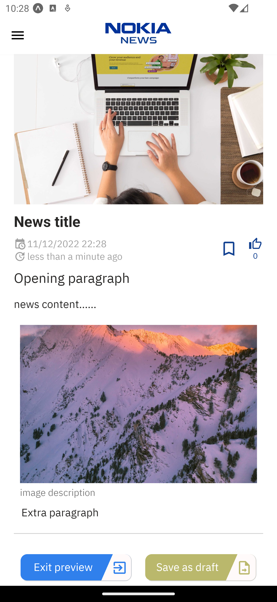

# myCampusNews-client

Frontend service for Nokia My Campus news project - Autumn 2022 - Metropolia

## API 

🔗 [**API Reference for backend server**](https://github.com/myxmxm/myCampusNews-server)

## BUILD

1. Clone the project

```
    git clone https://github.com/Nischhal3/myCampusNews-client.git
```

2. Install Expo Go globally

```
    npm install -g expo-cli
```

3. Install NodeJS

4. Install dependencies

```
    npm i
```

5. Run the application

```
expo start
```

## SCREENSHOTS OF THE DEPLOYED APP

Splash, Login and Registration screen

<p  align="row">


</p>

Drawer navigation

<p  align="row">


</p>

Home screen


Single news screen
<p  align="row">


</p>

News publishing screen

<p  align="row">



</p>

Manage user and news screen

<p  align="row">


</p>

Drafted news and bookmarked news screen

<p  align="row">


</p>

Notification


Setting screens

<p  align="row">


</p>

## CONTRIBUTORS

[Nischhal Shrestha](https://github.com/Nischhal3) <br>
[Boris Hoi](https://github.com/Borissss420)<br>
[Xiaoming Ma](https://github.com/myxmxm)<br>


